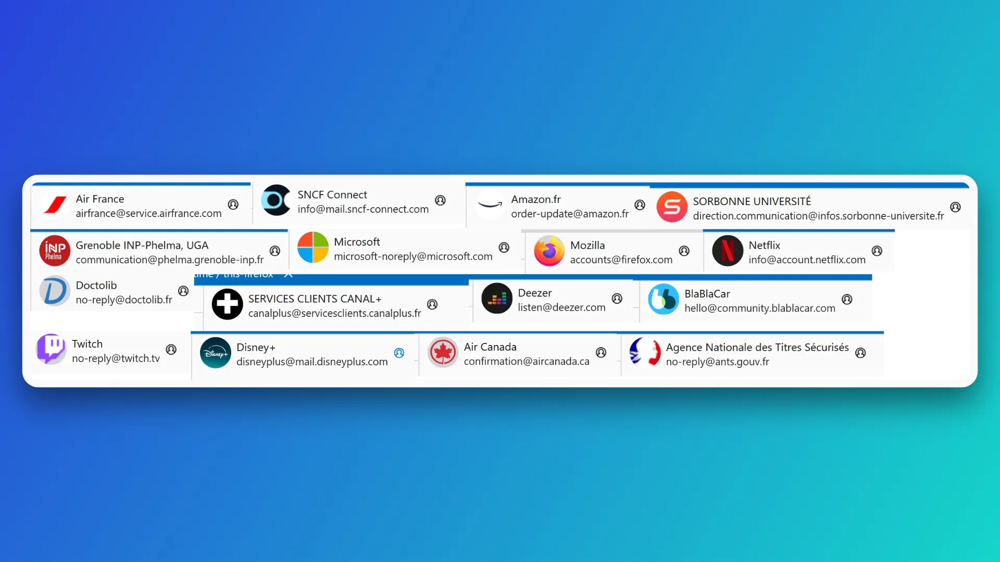
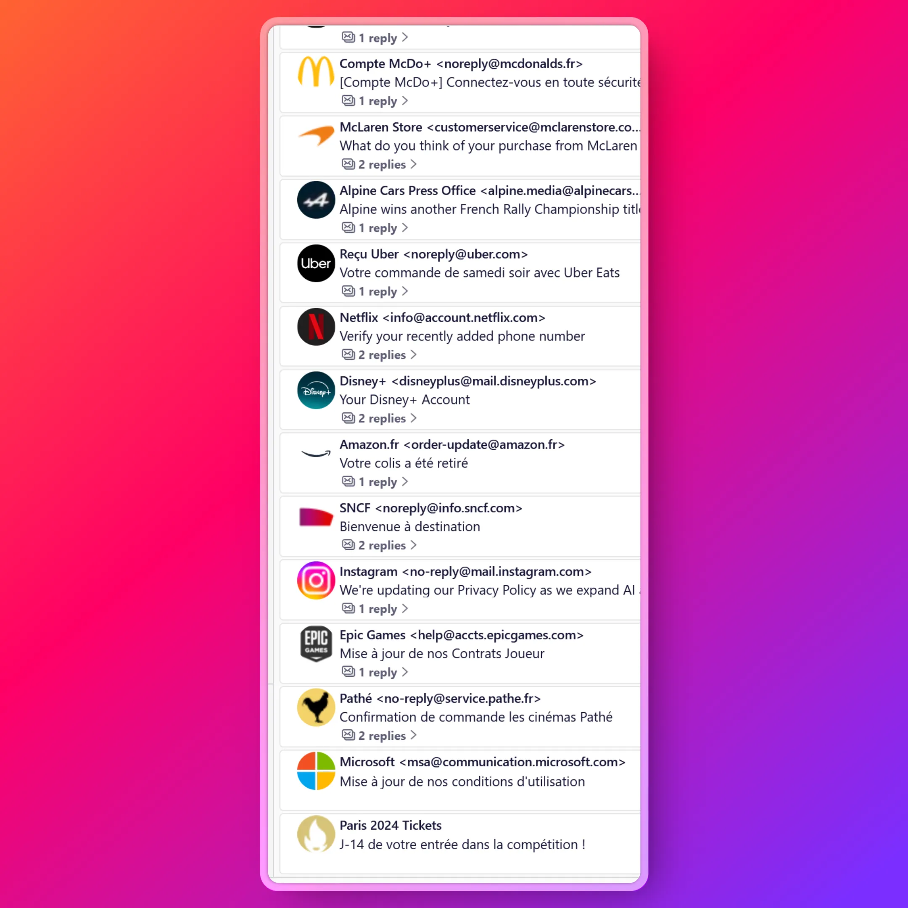

<h3 align="center">Auto Profile Picture</h3>
<h4 align="center">Mozilla Thunderbird Add-on</h4>

Upgrade your Thunderbird experience with intelligent sender visualization that transforms how you identify and manage emails.
 
 
<a href="https://addons.thunderbird.net/thunderbird/addon/auto-profile-picture/"><strong>Install on the official Thunderbird add-ons website »</strong></a>

## About The Extension

Upgrade your inbox with clearer, more recognizable sender visuals — making email management smoother and more intuitive.

- **Automated Profile Images**: Replaces default grey sender icons with their **company logos** or **Gravatar avatars** for a more organized and professional inbox. 🏢
- **Automatic Contact Pictures**: Automatically assigns a profile picture to contacts when you save them without a photo, simplifying your contact list management. 👥✨
- **Inbox & Message Header Customization**: Adds profile images to both your **inbox list** and **message headers**, improving sender recognition at a glance. 📧🖼️
- **BIMI Support**: Supports **Brand Indicators for Message Identification (BIMI)**, displaying official logos from companies. ✅🔒
- **Streamlined Interface**: Delivers a cleaner, more efficient email experience with instant visual identification of senders. 🖥️✨
- Compatible with Thunderbird extension Thunderbird Conversations

## Installation

Official installation (requires Internet access) from [Thunderbird Add-on site](https://addons.thunderbird.net/):

- Download and install [Auto Profile Picture](https://addons.thunderbird.net/thunderbird/addon/auto-profile-picture/) via the `Add-ons Manager`.
- From the [Thunderbird Menu Bar](https://support.mozilla.org/en-US/kb/display-thunderbird-menus-and-toolbar), select `Add-ons and Themes` to open the menu.
- In the search field, type `Auto Profile Picture` and press `Enter`.
- Click on the `+ Add to Thunderbird` button, then click `Add` on the confirmation dialog to confirm.

Install (with or without Internet access) the XPI file directly:
- Download [GitHub XPI version](https://github.com/noam-sc/thunderbird-auto-profile-picture/releases/latest) via the `Add-ons Manager`.
- From the [Thunderbird Menu Bar](https://support.mozilla.org/en-US/kb/display-thunderbird-menus-and-toolbar), select `Add-ons and Themes` to open the menu.
- Click the gear icon and choose `Install Add-on From File…`
- Choose the downloaded XPI file, and click `Add`.

## Support this project

If you find this project useful, please consider supporting it by:

- 📝 [Writing a review](https://addons.thunderbird.net/thunderbird/addon/auto-profile-picture/reviews/) on the Thunderbird Add-ons website (ATN)
- ⭐️ Giving a Star on the GitHub repository.
- Contribute to the project by reporting bugs, suggesting new features, or submitting pull requests.

If you encounter any problem, please issue a bug report. If you have ideas for additional features, please issue a feature request.

## Contributing

Use this section to get started on developing this addon locally. Any contributions you make are **greatly appreciated**.

If you have a suggestion that would make this better, please fork the repo and create a pull request. You can also simply open an issue with the tag "enhancement".

### Prerequisites

- Mozilla Thunderbird
- Git

### Installation

- [Clone](https://docs.github.com/en/repositories/creating-and-managing-repositories/cloning-a-repository) this Git repository
- In Thunderbird Add-ons settings page, click on the gear icon
- Choose `Debug Add-ons`
- Click on `Load Temporary Add-on...`
- Select the `manifest.json` file in the `/src/` folder of this repository

## License

Distributed under the MPL 2.0 License. See [MPL 2.0 License](https://opensource.org/license/mpl-2-0) for more information.

## Credits

This add-on relies on some open sourced projects

- [Mozilla Thunderbird](https://www.thunderbird.net/)
- [ICAL.js](https://github.com/kewisch/ical.js)
- Extension contacts part: Auto Avatar extension by Seth Falco
- Extension icon: Iconsax Duotone Filled Icons collection by Iconsax